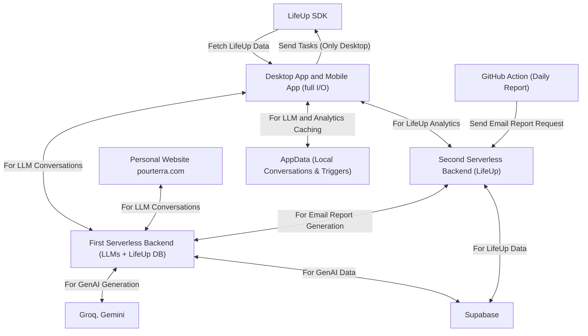

<h1 align = "center">
  
</h1>
 

 
  
  
  <a href="https://www.pourterra.com" target="_blank">
      <!-- sqlite, safari, google-chrome are other good icon options -->
  </a>

 
<h2 align="center">Languages-Frameworks-Tools</h2>

    
     

<h2 align="center">Github Statistics</h2>

<!--      -->
    

    

   
  <h2>🐍 My Contributions 🐍</h2>

  
  
     

# My Personal System Architecture

#### Connection Semantics

- `Send`: Subject A owns the data and actively transmits it to Subject B without solicitation. B does not request anything—A initiates the transfer. B only acknowledges receipt (success/failure), not transformation or response.
- `Fetch`: Subject B owns the data, and Subject A initiates a request to receive it. B does not learn anything about A in the process—it simply fulfills the request. The interaction is one-way in function but initiated by the consumer.
- `For`: A and B engage in mutual processing. The request leads to transformation or computation on both ends. Data, context, or state changes are involved in either or both systems. This is a purpose-driven collaboration.
- `LLM (Large Language Model)`: Narrow-scope, text-focused generative AI. Includes dialogue, summarization, and RAG operations like vector embedding or function calling—as long as they remain in the service of textual reasoning or output. Image, speech, or video tasks are excluded.
- `GenAI (Generative AI)`: Broad-scope, multi-modal generation. Encompasses all generative domains: text, audio, image, video. LLMs are a subset of GenAI, but not synonymous with it. Use when referring to the infrastructure or request path involving any generative capability.

#### Device Context

- **TauriApp (Desktop only)**: Full read/write access to LifeUp SDK
- **TauriApp (Mobile)**: Read-only to LifeUp SDK

<!--
**pour-le-hommes/pour-le-hommes** is a ✨ _special_ ✨ repository because its `README.md` (this file) appears on your GitHub profile.

Here are some ideas to get you started:

- 🔭 I’m currently working on ...
- 🌱 I’m currently learning ...
- 👯 I’m looking to collaborate on ...
- 🤔 I’m looking for help with ...
- 💬 Ask me about ...
- 📫 How to reach me: ...
- 😄 Pronouns: ...
- ⚡ Fun fact: ...
-->
